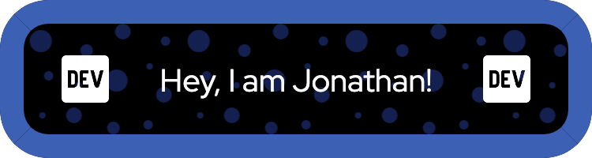

### Hi there 👋
### I've been developing code for just over three years now 💪
### I'm familiar with many differnet languages but love *Java* and *Javascript*!
### I'm currently learning TypeScript + the Spring framework 🌱
### I contribute to Open Source projects in my spare time 👯

<!--
**JonnyMc94/JonnyMc94** is a ✨ _special_ ✨ repository because its `README.md` (this file) appears on your GitHub profile.

Here are some ideas to get you started:

- 🔭 I’m currently working on ...
- 🌱 I’m currently learning ...
- 👯 I’m looking to collaborate on ...
- 🤔 I’m looking for help with ...
- 💬 Ask me about ...
- 📫 How to reach me: ...
- 😄 Pronouns: ...
- ⚡ Fun fact: ...
-->
